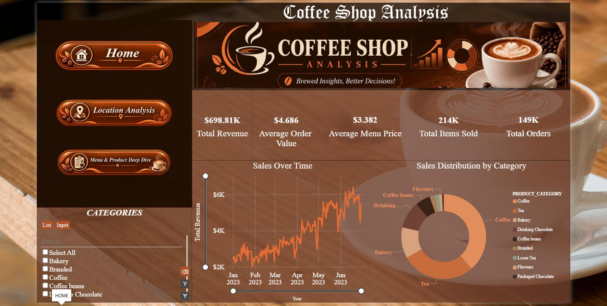
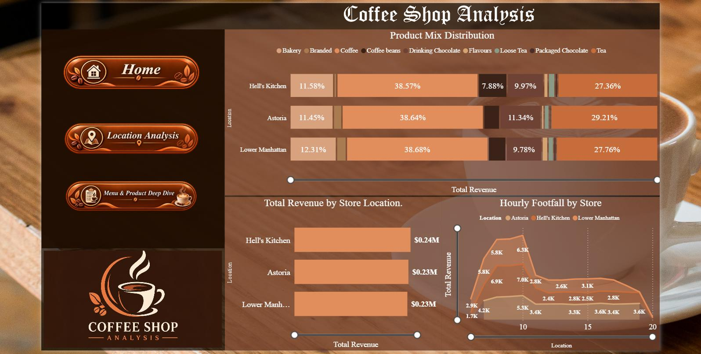
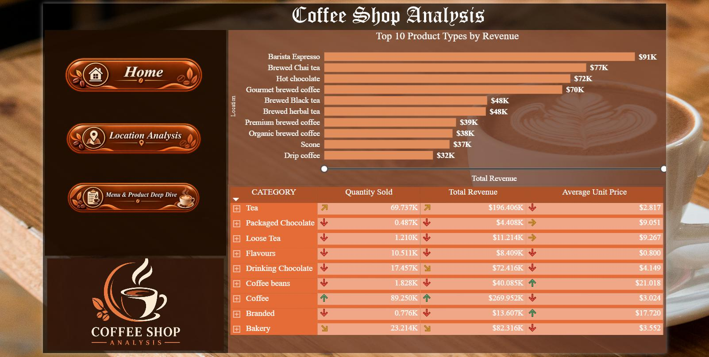

# Coffee Shop Sales & Operations Analysis ☕📊

An interactive **Power BI Dashboard** analyzing coffee shop sales performance, transaction trends, customer ordering behaviors, and product profitability to drive operational efficiency and revenue growth.

## 🌟 Key Insights & Features
- **Executive KPI Summary:** Track Total Revenue, Total Orders, Total Quantity Sold, and Average Order Value (AOV).
- **Sales & Peak Hour Trends:** Identification of peak rush hours, busiest days of the week, and monthly sales trajectories.
- **Product & Category Performance:** Deep dive into top-performing coffee beverages, bakery items, and size preferences (Large vs. Medium vs. Small).
- **Store Location Breakdown:** Comparative analysis across multiple store locations to identify high-margin regions.

---

## 🛠️ Tech Stack & Tools
- **Business Intelligence:** Microsoft Power BI Desktop
- **Data Modeling:** DAX (Data Analysis Expressions) for dynamic aggregations & time-intelligence calculations
- **Data Transformation:** Power Query / ETL

## 📸 Dashboard Preview

### 1. Overview Page

### 2. Store Location Analysis

### 3.  Menu & Product Deep Dive
